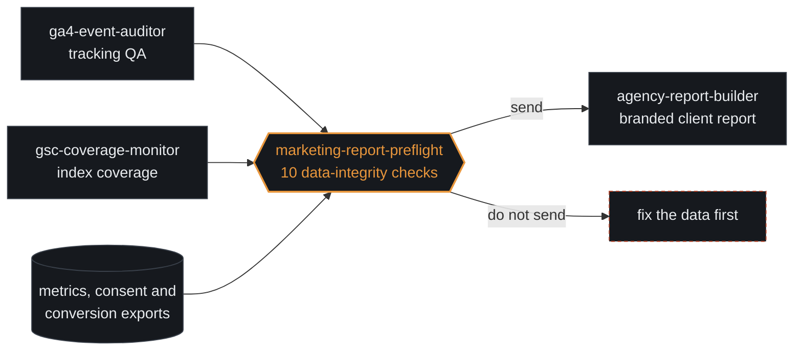

 

 

Computer engineer by degree, marketing and brand leader by trade. I lead brand and digital growth at **AM PM Properties** in Calgary, and I still write the software my marketing runs on: the Python and Node tools below audit tracking, watch search coverage and stop a client report from going out on broken data.

I started in 2011 building websites, spent six years as a senior web developer, then seven years running marketing and web operations for 10+ client accounts at a time. So I can plan the campaign, and I can build the system that tells us honestly whether it worked.

---

## Two halves of the same job

<table>
<tr>
<td valign="top" width="50%">

### Engineering

Python and Node tooling against the GA4 Data API, Search Console API and Google Ads exports. Tested, documented, running in CI.

</td>
<td valign="top" width="50%">

### Marketing and brand

Brand strategy and positioning, search and social campaigns, technical and local SEO, reputation, and the monthly reporting that ties it together.

</td>
</tr>
</table>

---

## Open source

Tools built for problems I hit in real client work. Each one runs on files or APIs an agency already has, and every repository runs its test suite in CI on every push.

<table>
<tr>
<td width="50%" valign="top">

</td>
<td width="50%" valign="top">

</td>
</tr>
<tr>
<td width="50%" valign="top">

</td>
<td width="50%" valign="top">

</td>
</tr>
<tr>
<td width="50%" valign="top">

</td>
<td width="50%" valign="top">

</td>
</tr>
<tr>
<td width="50%" valign="top">

</td>
<td width="50%" valign="top">

</td>
</tr>
<tr>
<td width="50%" valign="top">

</td>
<td width="50%" valign="top">

</td>
</tr>
</table>

### How they fit together

The tools form one chain rather than ten unrelated scripts. Each writes JSON the next one reads.

Writing, not code: [digital-marketing-case-studies](https://github.com/mehranmoghadasi/digital-marketing-case-studies) (anonymised campaign write-ups) and [social-media-marketing-playbook](https://github.com/mehranmoghadasi/social-media-marketing-playbook) (the channel playbook I use for service businesses).

---

## Building next

Planned, not shipped. Listed so the direction is clear, and revised whenever client work says something else matters more.

---

## Experience

Fifteen years across both halves of the job. The tags show which half each role leaned on.

| Role | Scope |
| --- | --- |
| **Digital Marketing & Brand Manager** AM PM Properties Inc, Calgary Jul 2026 to present  | All brand, digital and growth work for a boutique property management company with 600+ residential properties: brand, website, SEO, paid campaigns, social, reputation, and monthly reporting to ownership. |
| **Digital Marketing Consultant** Upwork, Edmonton (remote) Jan 2026 to Jun 2026  | Consulting and hands-on execution for small and medium businesses while establishing myself in the Canadian market: SEO audits, Google and Meta campaigns, WordPress builds. |
| **Web & Digital Marketing Manager** Fanavari Rayan Mehr Rahjoo, Tehran Oct 2018 to Dec 2025   | Marketing, brand and web operations for 10+ client accounts at a time. Led a cross-functional team of ten and ran paid budgets from $900 to $5,000 per client per month. Most of the tooling above began as internal scripts here. |
| **Senior Web Developer & Digital Marketing Specialist** Persia Mehr Co., Tehran Oct 2012 to Sep 2018   | Designed, built and marketed 30+ WordPress sites for local businesses and professional services, owning both the build and the campaigns that followed it. |
| **Web Developer, internship** Iricom IT Center, Isfahan Oct 2011 to Oct 2012  | Web interfaces, network and VoIP configuration, and infrastructure support. The engineering grounding the rest of this timeline is built on. |

## Education

 &nbsp;University of Isfahan, 2008 to 2012

 &nbsp;Islamic Azad University, Science and Research Branch, 2013 to 2015

---

Open to brand, growth and marketing-technology roles in Calgary, and to issues or pull requests on anything above.

